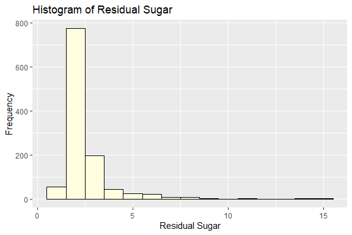

Wine Quality Prediction
================
Trevor Okinda
2024

- [Student Details](#student-details)
- [Setup Chunk](#setup-chunk)
- [Understanding the Dataset (Exploratory Data Analysis
  (EDA))](#understanding-the-dataset-exploratory-data-analysis-eda)
  - [Loading the Dataset](#loading-the-dataset)
    - [Source:](#source)
    - [Reference:](#reference)
- [Exploratory Data Analysis](#exploratory-data-analysis)
  - [Load dataset](#load-dataset)
  - [Measures of frequency](#measures-of-frequency)
  - [Measures of Central Tendency](#measures-of-central-tendency)
  - [Measures of Distribution](#measures-of-distribution)
  - [Measures of Relationship](#measures-of-relationship)
  - [Plots](#plots)
- [Preprocessing and Data
  Transformation](#preprocessing-and-data-transformation)
  - [Missing values](#missing-values)
  - [Transformation](#transformation)
- [Training Model](#training-model)
  - [Data splitting](#data-splitting)
  - [Bootstrapping](#bootstrapping)
  - [Cross-validation](#cross-validation)
  - [Training different models](#training-different-models)
  - [Model performance comparison](#model-performance-comparison)
  - [Saving Model](#saving-model)

# Student Details

|                       |                         |
|-----------------------|-------------------------|
| **Student ID Number** | 134780                  |
| **Student Name**      | Trevor Okinda           |
| **BBIT 4.2 Group**    | C                       |
| **Project Name**      | Wine Quality Prediction |

# Setup Chunk

**Note:** the following KnitR options have been set as the global
defaults: <BR>
`knitr::opts_chunk$set(echo = TRUE, warning = FALSE, eval = TRUE, collapse = FALSE, tidy = TRUE)`.

More KnitR options are documented here
<https://bookdown.org/yihui/rmarkdown-cookbook/chunk-options.html> and
here <https://yihui.org/knitr/options/>.

# Understanding the Dataset (Exploratory Data Analysis (EDA))

## Loading the Dataset

### Source:

The dataset that was used can be downloaded here:
*\<<a href="https://www.kaggle.com/datasets/yasserh/wine-quality-dataset\"
class="uri">https://www.kaggle.com/datasets/yasserh/wine-quality-dataset\</a>\>*

### Reference:

\*\<Kaggle. (n.d.). Wine Quality Dataset. Retrieved from
<a href="https://www.kaggle.com/datasets/yasserh/wine-quality-dataset\"
class="uri">https://www.kaggle.com/datasets/yasserh/wine-quality-dataset\</a>\>  

Refer to the APA 7th edition manual for rules on how to cite datasets:
<https://apastyle.apa.org/style-grammar-guidelines/references/examples/data-set-references>\*

# Exploratory Data Analysis

## Load dataset

``` r
# Load the wine quality dataset
wine_data <- read.csv("WineQT.csv", colClasses = c(
  fixed_acidity = "numeric",
  volatile_acidity = "numeric",
  citric_acid = "numeric",
  residual_sugar = "numeric",
  chlorides = "numeric",
  free_sulfur_dioxide = "numeric",
  total_sulfur_dioxide = "numeric",
  density = "numeric",
  pH = "numeric",
  sulphates = "numeric",
  alcohol = "numeric",
  quality = "numeric",
  Id = "character"
), header = TRUE)

# Display the structure of the dataset
str(wine_data)
```

    ## 'data.frame':    1143 obs. of  13 variables:
    ##  $ fixed_acidity       : num  7.4 7.8 7.8 11.2 7.4 7.4 7.9 7.3 7.8 6.7 ...
    ##  $ volatile_acidity    : num  0.7 0.88 0.76 0.28 0.7 0.66 0.6 0.65 0.58 0.58 ...
    ##  $ citric_acid         : num  0 0 0.04 0.56 0 0 0.06 0 0.02 0.08 ...
    ##  $ residual_sugar      : num  1.9 2.6 2.3 1.9 1.9 1.8 1.6 1.2 2 1.8 ...
    ##  $ chlorides           : num  0.076 0.098 0.092 0.075 0.076 0.075 0.069 0.065 0.073 0.097 ...
    ##  $ free_sulfur_dioxide : num  11 25 15 17 11 13 15 15 9 15 ...
    ##  $ total_sulfur_dioxide: num  34 67 54 60 34 40 59 21 18 65 ...
    ##  $ density             : num  0.998 0.997 0.997 0.998 0.998 ...
    ##  $ pH                  : num  3.51 3.2 3.26 3.16 3.51 3.51 3.3 3.39 3.36 3.28 ...
    ##  $ sulphates           : num  0.56 0.68 0.65 0.58 0.56 0.56 0.46 0.47 0.57 0.54 ...
    ##  $ alcohol             : num  9.4 9.8 9.8 9.8 9.4 9.4 9.4 10 9.5 9.2 ...
    ##  $ quality             : num  5 5 5 6 5 5 5 7 7 5 ...
    ##  $ Id                  : chr  "0" "1" "2" "3" ...

``` r
# View the first few rows of the dataset
head(wine_data)
```

    ##   fixed_acidity volatile_acidity citric_acid residual_sugar chlorides
    ## 1           7.4             0.70        0.00            1.9     0.076
    ## 2           7.8             0.88        0.00            2.6     0.098
    ## 3           7.8             0.76        0.04            2.3     0.092
    ## 4          11.2             0.28        0.56            1.9     0.075
    ## 5           7.4             0.70        0.00            1.9     0.076
    ## 6           7.4             0.66        0.00            1.8     0.075
    ##   free_sulfur_dioxide total_sulfur_dioxide density   pH sulphates alcohol
    ## 1                  11                   34  0.9978 3.51      0.56     9.4
    ## 2                  25                   67  0.9968 3.20      0.68     9.8
    ## 3                  15                   54  0.9970 3.26      0.65     9.8
    ## 4                  17                   60  0.9980 3.16      0.58     9.8
    ## 5                  11                   34  0.9978 3.51      0.56     9.4
    ## 6                  13                   40  0.9978 3.51      0.56     9.4
    ##   quality Id
    ## 1       5  0
    ## 2       5  1
    ## 3       5  2
    ## 4       6  3
    ## 5       5  4
    ## 6       5  5

``` r
# Remove the last column
wine_data <- wine_data[, -ncol(wine_data)]

# Open the dataset in a viewer window
View(wine_data)
```

## Measures of frequency

``` r
# Calculate measures of frequency
summary_stats <- summary(wine_data)

# Display the measures of frequency
print(summary_stats)
```

    ##  fixed_acidity    volatile_acidity  citric_acid     residual_sugar  
    ##  Min.   : 4.600   Min.   :0.1200   Min.   :0.0000   Min.   : 0.900  
    ##  1st Qu.: 7.100   1st Qu.:0.3925   1st Qu.:0.0900   1st Qu.: 1.900  
    ##  Median : 7.900   Median :0.5200   Median :0.2500   Median : 2.200  
    ##  Mean   : 8.311   Mean   :0.5313   Mean   :0.2684   Mean   : 2.532  
    ##  3rd Qu.: 9.100   3rd Qu.:0.6400   3rd Qu.:0.4200   3rd Qu.: 2.600  
    ##  Max.   :15.900   Max.   :1.5800   Max.   :1.0000   Max.   :15.500  
    ##    chlorides       free_sulfur_dioxide total_sulfur_dioxide    density      
    ##  Min.   :0.01200   Min.   : 1.00       Min.   :  6.00       Min.   :0.9901  
    ##  1st Qu.:0.07000   1st Qu.: 7.00       1st Qu.: 21.00       1st Qu.:0.9956  
    ##  Median :0.07900   Median :13.00       Median : 37.00       Median :0.9967  
    ##  Mean   :0.08693   Mean   :15.62       Mean   : 45.91       Mean   :0.9967  
    ##  3rd Qu.:0.09000   3rd Qu.:21.00       3rd Qu.: 61.00       3rd Qu.:0.9978  
    ##  Max.   :0.61100   Max.   :68.00       Max.   :289.00       Max.   :1.0037  
    ##        pH          sulphates         alcohol         quality     
    ##  Min.   :2.740   Min.   :0.3300   Min.   : 8.40   Min.   :3.000  
    ##  1st Qu.:3.205   1st Qu.:0.5500   1st Qu.: 9.50   1st Qu.:5.000  
    ##  Median :3.310   Median :0.6200   Median :10.20   Median :6.000  
    ##  Mean   :3.311   Mean   :0.6577   Mean   :10.44   Mean   :5.657  
    ##  3rd Qu.:3.400   3rd Qu.:0.7300   3rd Qu.:11.10   3rd Qu.:6.000  
    ##  Max.   :4.010   Max.   :2.0000   Max.   :14.90   Max.   :8.000

## Measures of Central Tendency

``` r
# Calculate measures of central tendency
means <- colMeans(wine_data, na.rm = TRUE)
medians <- apply(wine_data, 2, median, na.rm = TRUE)

# Calculate mode
getmode <- function(v) {
  uniqv <- unique(v)
  uniqv[which.max(tabulate(match(v, uniqv)))]
}
modes <- sapply(wine_data, getmode)

# Create a data frame to display the measures
central_tendency <- data.frame(
  Variable = names(wine_data),
  Mean = means,
  Median = medians,
  Mode = modes
)

# Print the measures of central tendency
print(central_tendency)
```

    ##                                  Variable        Mean   Median    Mode
    ## fixed_acidity               fixed_acidity  8.31111111  7.90000  7.2000
    ## volatile_acidity         volatile_acidity  0.53133858  0.52000  0.6000
    ## citric_acid                   citric_acid  0.26836395  0.25000  0.0000
    ## residual_sugar             residual_sugar  2.53215223  2.20000  2.0000
    ## chlorides                       chlorides  0.08693263  0.07900  0.0800
    ## free_sulfur_dioxide   free_sulfur_dioxide 15.61548556 13.00000  6.0000
    ## total_sulfur_dioxide total_sulfur_dioxide 45.91469816 37.00000 28.0000
    ## density                           density  0.99673041  0.99668  0.9976
    ## pH                                     pH  3.31101487  3.31000  3.3000
    ## sulphates                       sulphates  0.65770779  0.62000  0.6000
    ## alcohol                           alcohol 10.44211140 10.20000  9.5000
    ## quality                           quality  5.65704287  6.00000  5.0000

## Measures of Distribution

``` r
# Calculate measures of distribution
ranges <- apply(wine_data, 2, function(x) diff(range(x, na.rm = TRUE)))
variances <- apply(wine_data, 2, var, na.rm = TRUE)
standard_deviations <- apply(wine_data, 2, sd, na.rm = TRUE)

# Create a data frame to display the measures
distribution_measures <- data.frame(
  Variable = names(wine_data),
  Range = ranges,
  Variance = variances,
  Standard_Deviation = standard_deviations
)

# Print the measures of distribution
print(distribution_measures)
```

    ##                                  Variable     Range     Variance
    ## fixed_acidity               fixed_acidity  11.30000 3.054088e+00
    ## volatile_acidity         volatile_acidity   1.46000 3.226808e-02
    ## citric_acid                   citric_acid   1.00000 3.868532e-02
    ## residual_sugar             residual_sugar  14.60000 1.838512e+00
    ## chlorides                       chlorides   0.59900 2.234201e-03
    ## free_sulfur_dioxide   free_sulfur_dioxide  67.00000 1.050725e+02
    ## total_sulfur_dioxide total_sulfur_dioxide 283.00000 1.074668e+03
    ## density                           density   0.01362 3.705883e-06
    ## pH                                     pH   1.27000 2.454363e-02
    ## sulphates                       sulphates   1.67000 2.903572e-02
    ## alcohol                           alcohol   6.50000 1.171147e+00
    ## quality                           quality   5.00000 6.493527e-01
    ##                      Standard_Deviation
    ## fixed_acidity               1.747595017
    ## volatile_acidity            0.179633193
    ## citric_acid                 0.196685852
    ## residual_sugar              1.355917467
    ## chlorides                   0.047267338
    ## free_sulfur_dioxide        10.250486123
    ## total_sulfur_dioxide       32.782130307
    ## density                     0.001925067
    ## pH                          0.156664060
    ## sulphates                   0.170398714
    ## alcohol                     1.082195610
    ## quality                     0.805824248

## Measures of Relationship

``` r
# Calculate measures of relationship (correlation)
correlation_matrix <- cor(wine_data, use = "pairwise.complete.obs")

# Print the correlation matrix
print(correlation_matrix)
```

    ##                      fixed_acidity volatile_acidity citric_acid residual_sugar
    ## fixed_acidity           1.00000000     -0.250728322  0.67315725    0.171830535
    ## volatile_acidity       -0.25072832      1.000000000 -0.54418694   -0.005751097
    ## citric_acid             0.67315725     -0.544186937  1.00000000    0.175814854
    ## residual_sugar          0.17183054     -0.005751097  0.17581485    1.000000000
    ## chlorides               0.10788857      0.056336259  0.24531249    0.070863112
    ## free_sulfur_dioxide    -0.16483079     -0.001962479 -0.05758910    0.165338797
    ## total_sulfur_dioxide   -0.11062837      0.077747722  0.03687111    0.190790035
    ## density                 0.68150088      0.016511520  0.37524326    0.380146952
    ## pH                     -0.68516260      0.221491518 -0.54633914   -0.116958936
    ## sulphates               0.17459183     -0.276078597  0.33123176    0.017474504
    ## alcohol                -0.07505485     -0.203909273  0.10625034    0.058420606
    ## quality                 0.12197010     -0.407393513  0.24082084    0.022001931
    ##                        chlorides free_sulfur_dioxide total_sulfur_dioxide
    ## fixed_acidity         0.10788857        -0.164830793          -0.11062837
    ## volatile_acidity      0.05633626        -0.001962479           0.07774772
    ## citric_acid           0.24531249        -0.057589104           0.03687111
    ## residual_sugar        0.07086311         0.165338797           0.19079003
    ## chlorides             1.00000000         0.015280458           0.04816316
    ## free_sulfur_dioxide   0.01528046         1.000000000           0.66109287
    ## total_sulfur_dioxide  0.04816316         0.661092872           1.00000000
    ## density               0.20890071        -0.054150318           0.05017483
    ## pH                   -0.27775907         0.072803706          -0.05912572
    ## sulphates             0.37478389         0.034445122           0.02689368
    ## alcohol              -0.22991709        -0.047094832          -0.18816480
    ## quality              -0.12408453        -0.063259641          -0.18333915
    ##                          density          pH   sulphates     alcohol
    ## fixed_acidity         0.68150088 -0.68516260  0.17459183 -0.07505485
    ## volatile_acidity      0.01651152  0.22149152 -0.27607860 -0.20390927
    ## citric_acid           0.37524326 -0.54633914  0.33123176  0.10625034
    ## residual_sugar        0.38014695 -0.11695894  0.01747450  0.05842061
    ## chlorides             0.20890071 -0.27775907  0.37478389 -0.22991709
    ## free_sulfur_dioxide  -0.05415032  0.07280371  0.03444512 -0.04709483
    ## total_sulfur_dioxide  0.05017483 -0.05912572  0.02689368 -0.18816480
    ## density               1.00000000 -0.35277462  0.14313929 -0.49472690
    ## pH                   -0.35277462  1.00000000 -0.18549903  0.22532220
    ## sulphates             0.14313929 -0.18549903  1.00000000  0.09442113
    ## alcohol              -0.49472690  0.22532220  0.09442113  1.00000000
    ## quality              -0.17520792 -0.05245303  0.25771026  0.48486621
    ##                          quality
    ## fixed_acidity         0.12197010
    ## volatile_acidity     -0.40739351
    ## citric_acid           0.24082084
    ## residual_sugar        0.02200193
    ## chlorides            -0.12408453
    ## free_sulfur_dioxide  -0.06325964
    ## total_sulfur_dioxide -0.18333915
    ## density              -0.17520792
    ## pH                   -0.05245303
    ## sulphates             0.25771026
    ## alcohol               0.48486621
    ## quality               1.00000000

## Plots

``` r
#Load package
library(ggplot2)

# Plot for 'fixed acidity'
ggplot(wine_data, aes(x = fixed_acidity)) +
  geom_histogram(binwidth = 0.5, fill = "skyblue", color = "black") +
  labs(title = "Histogram of Fixed Acidity", x = "Fixed Acidity", y = "Frequency")
```

<!-- -->

``` r
# Plot for 'volatile acidity'
ggplot(wine_data, aes(x = volatile_acidity)) +
  geom_histogram(binwidth = 0.05, fill = "lightgreen", color = "black") +
  labs(title = "Histogram of Volatile Acidity", x = "Volatile Acidity", y = "Frequency")
```

<!-- -->

``` r
# Plot for 'citric acid'
ggplot(wine_data, aes(x = citric_acid)) +
  geom_histogram(binwidth = 0.05, fill = "lightcoral", color = "black") +
  labs(title = "Histogram of Citric Acid", x = "Citric Acid", y = "Frequency")
```

<!-- -->

``` r
# Plot for 'residual sugar'
ggplot(wine_data, aes(x = residual_sugar)) +
  geom_histogram(binwidth = 1, fill = "lightyellow", color = "black") +
  labs(title = "Histogram of Residual Sugar", x = "Residual Sugar", y = "Frequency")
```

<!-- -->

``` r
# Scatter plot for 'fixed acidity' vs 'volatile acidity'
ggplot(wine_data, aes(x = fixed_acidity, y = volatile_acidity)) +
  geom_point(color = "blue") +
  labs(title = "Scatter Plot: Fixed Acidity vs Volatile Acidity", x = "Fixed Acidity", y = "Volatile Acidity")
```

<!-- -->

``` r
# Scatter plot for 'fixed acidity' vs 'citric acid'
ggplot(wine_data, aes(x = fixed_acidity, y = citric_acid)) +
  geom_point(color = "green") +
  labs(title = "Scatter Plot: Fixed Acidity vs Citric Acid", x = "Fixed Acidity", y = "Citric Acid")
```

<!-- -->

``` r
# Scatter plot for 'fixed acidity' vs 'residual sugar'
ggplot(wine_data, aes(x = fixed_acidity, y = residual_sugar)) +
  geom_point(color = "red") +
  labs(title = "Scatter Plot: Fixed Acidity vs Residual Sugar", x = "Fixed Acidity", y = "Residual Sugar")
```

<!-- -->

# Preprocessing and Data Transformation

## Missing values

``` r
# Check for missing values
missing_values <- anyNA(wine_data)

# Display result
if (missing_values) {
  print("The dataset contains missing values.")
} else {
  print("The dataset does not contain missing values.")
}
```

    ## [1] "The dataset does not contain missing values."

## Transformation

``` r
# Select only numeric variables for transformation
numeric_vars <- wine_data[, sapply(wine_data, is.numeric)]

# Perform standardization (z-score normalization) on numeric variables
standardized_data <- scale(numeric_vars)

# Convert the standardized data back to a data frame
standardized_df <- as.data.frame(standardized_data)

# Replace the numeric variables in the original dataset with the standardized ones
wine_data[, sapply(wine_data, is.numeric)] <- standardized_df

# View the transformed dataset
head(wine_data)
```

    ##   fixed_acidity volatile_acidity citric_acid residual_sugar  chlorides
    ## 1    -0.5213514        0.9389212   -1.364429    -0.46621734 -0.2312936
    ## 2    -0.2924654        1.9409632   -1.364429     0.05003827  0.2341441
    ## 3    -0.2924654        1.2729352   -1.161059    -0.17121413  0.1072065
    ## 4     1.6530654       -1.3991767    1.482750    -0.46621734 -0.2524499
    ## 5    -0.5213514        0.9389212   -1.364429    -0.46621734 -0.2312936
    ## 6    -0.5213514        0.7162452   -1.364429    -0.53996814 -0.2524499
    ##   free_sulfur_dioxide total_sulfur_dioxide    density         pH   sulphates
    ## 1         -0.45026992           -0.3634510 0.55561117  1.2701390 -0.57340683
    ## 2          0.91551896            0.6431950 0.03614877 -0.7086174  0.13082384
    ## 3         -0.06004452            0.2466375 0.14004125 -0.3256323 -0.04523383
    ## 4          0.13506817            0.4296640 0.65950365 -0.9639408 -0.45603505
    ## 5         -0.45026992           -0.3634510 0.55561117  1.2701390 -0.57340683
    ## 6         -0.25515722           -0.1804245 0.55561117  1.2701390 -0.57340683
    ##      alcohol    quality
    ## 1 -0.9629603 -0.8153675
    ## 2 -0.5933413 -0.8153675
    ## 3 -0.5933413 -0.8153675
    ## 4 -0.5933413  0.4255979
    ## 5 -0.9629603 -0.8153675
    ## 6 -0.9629603 -0.8153675

# Training Model

## Data splitting

``` r
# Load the required library
library(caret)
```

    ## Loading required package: lattice

``` r
# Set seed for reproducibility
set.seed(123)

# Split the dataset into training and testing sets (70% training, 30% testing)
train_indices <- createDataPartition(wine_data$quality, p = 0.7, list = FALSE)
train_data <- wine_data[train_indices, ]
test_data <- wine_data[-train_indices, ]

# Summary of the split
cat("Training set size:", nrow(train_data), "\n")
```

    ## Training set size: 802

``` r
cat("Number of variables in training set:", ncol(train_data), "\n")
```

    ## Number of variables in training set: 12

``` r
cat("\n")
```

``` r
cat("Testing set size:", nrow(test_data), "\n")
```

    ## Testing set size: 341

``` r
cat("Number of variables in testing set:", ncol(test_data), "\n")
```

    ## Number of variables in testing set: 12

## Bootstrapping

``` r
# Set seed for reproducibility
set.seed(123)

# Number of bootstrap iterations
num_iterations <- 1000

# Function to calculate the statistic of interest (e.g., mean, median) from a sample
calculate_statistic <- function(data) {
  # Example: Calculate the mean of the 'quality' variable
  return(mean(data$quality))
}

# Perform bootstrapping
bootstrap_results <- replicate(num_iterations, {
  # Sample with replacement
  boot_sample <- wine_data[sample(nrow(wine_data), replace = TRUE), ]
  # Calculate the statistic of interest
  calculate_statistic(boot_sample)
})

# Summary of bootstrapped results
summary(bootstrap_results)
```

    ##      Min.   1st Qu.    Median      Mean   3rd Qu.      Max. 
    ## -0.087942 -0.020628 -0.002171 -0.001544  0.017643  0.092285

## Cross-validation

``` r
# Load the required library
library(caret)

# Define the number of folds
num_folds <- 10  # You can adjust this value based on your preference

# Define the control parameters for cross-validation
train_control <- trainControl(method = "cv", number = num_folds)

# Define the model training
# Example: Linear regression using the 'lm' function
model <- train(quality ~ ., data = wine_data, method = "lm", trControl = train_control)

# Display the model performance
print(model)
```

    ## Linear Regression 
    ## 
    ## 1143 samples
    ##   11 predictor
    ## 
    ## No pre-processing
    ## Resampling: Cross-Validated (10 fold) 
    ## Summary of sample sizes: 1029, 1029, 1029, 1029, 1029, 1029, ... 
    ## Resampling results:
    ## 
    ##   RMSE       Rsquared   MAE      
    ##   0.8023112  0.3614719  0.6216339
    ## 
    ## Tuning parameter 'intercept' was held constant at a value of TRUE

## Training different models

``` r
# Load the required libraries
library(caret)
library(randomForest)
```

    ## randomForest 4.7-1.1

    ## Type rfNews() to see new features/changes/bug fixes.

    ## 
    ## Attaching package: 'randomForest'

    ## The following object is masked from 'package:ggplot2':
    ## 
    ##     margin

``` r
# Set seed for reproducibility
set.seed(123)

# Define the control parameters for cross-validation
train_control <- trainControl(method = "cv", number = 10)

# Model training - Linear Regression
linear_model <- train(quality ~ ., data = wine_data, method = "lm", trControl = train_control)

# Model training - Random Forest
rf_model <- train(quality ~ ., data = wine_data, method = "rf", trControl = train_control)

# Display model performance
print(linear_model)
```

    ## Linear Regression 
    ## 
    ## 1143 samples
    ##   11 predictor
    ## 
    ## No pre-processing
    ## Resampling: Cross-Validated (10 fold) 
    ## Summary of sample sizes: 1028, 1028, 1028, 1030, 1029, 1029, ... 
    ## Resampling results:
    ## 
    ##   RMSE       Rsquared   MAE      
    ##   0.7992867  0.3658229  0.6197075
    ## 
    ## Tuning parameter 'intercept' was held constant at a value of TRUE

``` r
print(rf_model)
```

    ## Random Forest 
    ## 
    ## 1143 samples
    ##   11 predictor
    ## 
    ## No pre-processing
    ## Resampling: Cross-Validated (10 fold) 
    ## Summary of sample sizes: 1029, 1028, 1029, 1028, 1029, 1029, ... 
    ## Resampling results across tuning parameters:
    ## 
    ##   mtry  RMSE       Rsquared   MAE      
    ##    2    0.7168566  0.4982140  0.5382587
    ##    6    0.7169498  0.4903701  0.5298349
    ##   11    0.7185292  0.4869357  0.5298983
    ## 
    ## RMSE was used to select the optimal model using the smallest value.
    ## The final value used for the model was mtry = 2.

## Model performance comparison

``` r
# Compare model performance using resamples
model_comparison <- resamples(list(LinearRegression = linear_model, RandomForest = rf_model))

# Summarize the results
summary(model_comparison)
```

    ## 
    ## Call:
    ## summary.resamples(object = model_comparison)
    ## 
    ## Models: LinearRegression, RandomForest 
    ## Number of resamples: 10 
    ## 
    ## MAE 
    ##                       Min.   1st Qu.    Median      Mean   3rd Qu.      Max.
    ## LinearRegression 0.5726533 0.5860900 0.6276870 0.6197075 0.6505246 0.6701389
    ## RandomForest     0.4310481 0.5247887 0.5373984 0.5382587 0.5587261 0.6385021
    ##                  NA's
    ## LinearRegression    0
    ## RandomForest        0
    ## 
    ## RMSE 
    ##                       Min.   1st Qu.    Median      Mean   3rd Qu.      Max.
    ## LinearRegression 0.7371257 0.7789284 0.8102311 0.7992867 0.8237021 0.8384366
    ## RandomForest     0.5919627 0.6872174 0.7010244 0.7168566 0.7558000 0.8539680
    ##                  NA's
    ## LinearRegression    0
    ## RandomForest        0
    ## 
    ## Rsquared 
    ##                       Min.   1st Qu.    Median      Mean   3rd Qu.      Max.
    ## LinearRegression 0.2928470 0.3384628 0.3519190 0.3658229 0.4010091 0.4528173
    ## RandomForest     0.3271839 0.4682229 0.4883142 0.4982140 0.5534831 0.6658982
    ##                  NA's
    ## LinearRegression    0
    ## RandomForest        0

## Saving Model

``` r
# Saving the best Random Forest model
saveRDS(rf_model$finalModel, "./models/rf_model.rds")

# Load the saved model
loaded_rf_model <- readRDS("./models/rf_model.rds")

# Prepare new data for prediction
new_data <- data.frame(
  fixed_acidity = 7.4,
  volatile_acidity = 0.7,
  citric_acid = 0.0,
  residual_sugar = 1.9,
  chlorides = 0.076,
  free_sulfur_dioxide = 11,
  total_sulfur_dioxide = 34,
  density = 0.9978,
  pH = 3.51,
  sulphates = 0.56,
  alcohol = 9.4
)

# Use the loaded model to make predictions
predictions_loaded_model <- predict(loaded_rf_model, newdata = new_data)

# Print predictions
print(predictions_loaded_model)
```

    ##         1 
    ## 0.1215614
